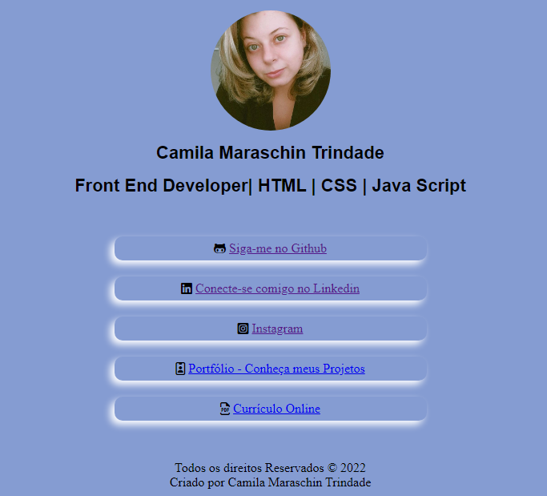

# Meu links 
### Projeto Pessoal

Desenvolvi meu próprio site de links e hospedá-lo gratuitamente no github pages.

## Projeto

### Linguagens Utilizadas

- HTML
- CSS

### Aprendizados

1 - Aprendi a como colocar icones utilizando o <link> https://fontawesome.com/  </link>  
2 - A como dar espaço entre a imagem e o link utilizando o codigo do tab  
3 - A centralizar as caxinhas com os links

### Dificuldades

1 - Colocar um link do PDF para abrir o currículo (não consegui ainda)
